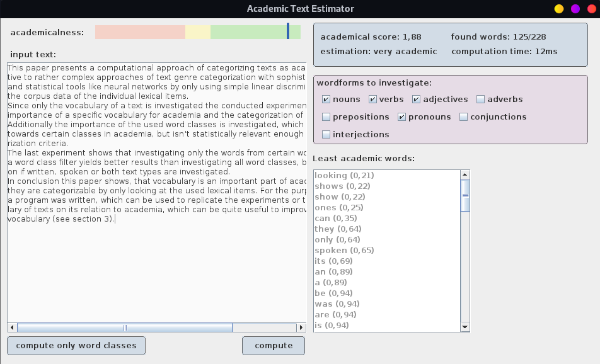

# AcademicalPaperEstimator
Project for my linguistic pragmatics seminar.
A program which uses Corpus data (in this repository a sample of the COCA word frequency list) to rate a given text on how academical it is by its vocabulary.
The paper that was written on the results generated with this program is called ["Importance of vocabulary for categorizing academic texts"](https://github.com/Frobeniusnorm/AcademicTextEstimator/blob/main/paper.pdf)
## Use
You need Java 8 or higher installed on your computer. Then you can either build the project yourself or just use the precompiled jar.
### Precompiled Executable
Download the [precompiled.zip](https://github.com/Frobeniusnorm/AcademicTextEstimator/releases/download/v1.1.1/precompiled.zip) file, unzip it and simply run the included jar file (depending on the os via double click or running `java -jar AcademicTextEstimator-assembly-1.1.1.jar`). The jar file requires the two `.csv` files.
### Changing the Corpus Data
Currently the program is only able to parse the data from the COCA corpus, i.e. it needs the two files `wordForms.csv` (word form list) and `wordFrequency.csv` (lemma list) with those exact names. They are generated from Libre Office Calc and the program expects as seperator char `;` and as decimal seperator `,`. If you have different Corpus data with another format, let me know and i may adapt the parser.
### Explanation of the UI

The UI consists of several control and information elements. 
The red-yellow-green bar shows the academical estimation of the text, were green means academic, yellow neutral and red unacademic. 
There are two buttons:
- *"compute"*: investigates every single lexical item and averages their academic *distribution score* and shows them in the statistic on the right.
- *"compute only word classes"*: reduces every lexical item to its word class. The *distribution score* of the word classes depending on their frequencies will be averaged according to the following, precalculated table:

  | Interjections | Pronouns | Adverbs | Conjunctions | Verbs | Nouns | Preposition | Adjectives |
  | --------------- | --------------- | --------------- | --------------- | --------------- | --------------- | --------------- | --------------- |
  | 0.0692 | 0.47 | 1.19 | 1.21 | 1.25 | 1.29 | 1.39 | 1.55 |

The statistic menu on the right consists of a blue and a purple box and a list:
- the blue box contains statistic about the text: the academical score (i.e. *distribution score*), the actually looked up words compared to the overall contained lexical items (remeber: not everything this program regards a lexical item is a word, see the regex in the source files for explanation). The computation time shows the time the estimation of the text took. The first computation will always be significantly slower, because of Just in time compilation and other factors.
- the purple box contains checkboxes for each word class. This is only relevant for the "compute" option: words from unchecked word classes will *not* be investigated.
- a word list also only relevant for the "compute" option, containing every found word form and its individual *distribution score*.
## Building
You need the JDK 8 or higher, the Scala Compiler and sbt. Then just clone the project and execute `sbt run` to build and run it.
If you want to generate executables use the command `assembly` in sbt i.e. `sbt assembly`, the executables will be written to "target/scala-x.y.z/AcademicTextEstimator-assembly-1.1.1.jar".
## Corpus Source
The used samples from the COCA corpus can be found at https://www.wordfrequency.info/. Huge thanks for providing that information.
